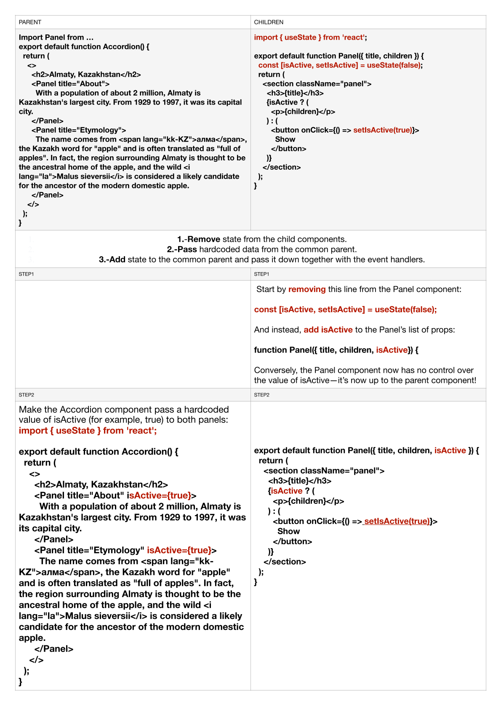
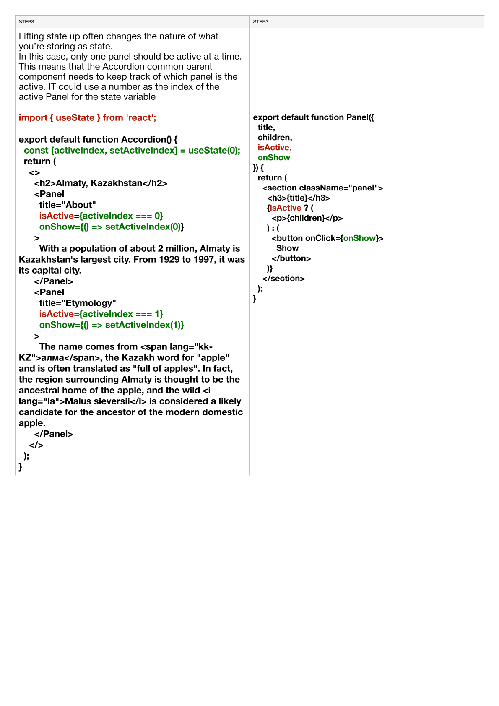
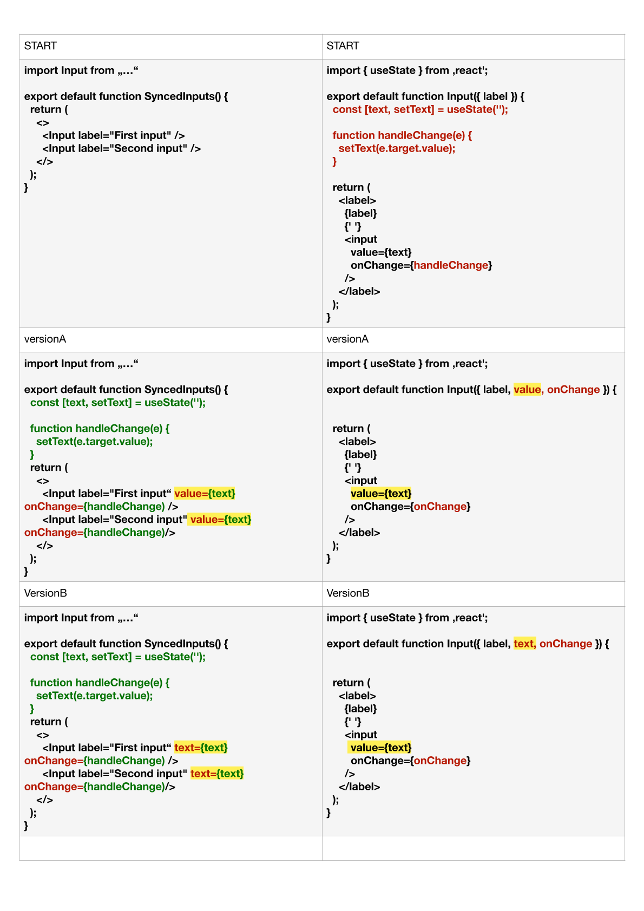
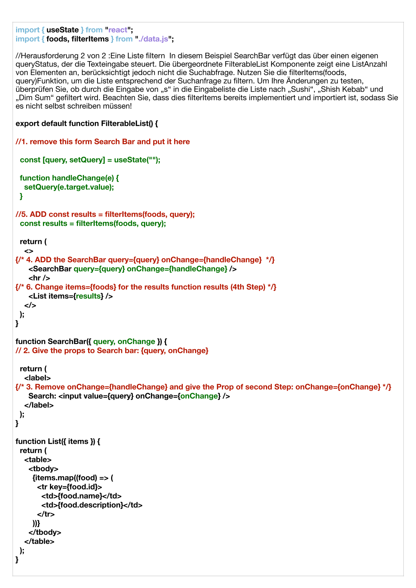

### React für anfänger

# Was sind Props in React:


Props, oder Eigenschaften, sind eine Möglichkeit, Daten an ein untergeordnetes Komponente zu übergeben. Eine Komponente erhält ein Props-Objekt als ersten Funktionsparameter.

Hier ist ein Beispiel, wie Props in einer Komponente verwendet werden:


```js

function UserCard(props) {
  return <div>{props.name}</div>;
}
````

Das Props-Objekt enthält die übergebenen Eigenschaften. In diesem Fall greifen wir auf die Eigenschaft name zu, indem wir props.name verwenden.

Um die Verwendung von Props einfacher zu machen, können wir das Props-Objekt auch in den Funktionsparametern destrukturieren:

```js
function UserCard({ name }) {
  return <div>{name}</div>;
}
````


In diesem Fall greifen wir direkt auf die Eigenschaft name zu, ohne props zu verwenden.


Du kannst beliebige Namen für deine Props verwenden. Es gibt jedoch einige Namenskonventionen. 
Beispielsweise werden boolesche Props häufig mit "is", "has" oder "should" als Präfix verwendet, z. B. isDisabled, hasError oder shouldShow. 
Props, die Funktionen enthalten, werden häufig mit "on" als Präfix verwendet, z. B. onClick, onSubmit oder onHover. 
Wenn du diese Konventionen befolgst, wird es einfacher, den Zweck der Prop zu verstehen.

Props können jeden Typ haben, z. B. Zeichenkette, Zahl, Array, Objekt, Funktion usw.

Um Props an eine Komponente zu übergeben, verwendest du Attribute. Hier ist ein Beispiel:

```js
<UserCard name="Alex" />
```


Du kannst verschiedene Arten von Daten als Props übergeben:


```js

<UserCard
  name="Alex"
  age={25}
  onContact={() => console.log("let's chat!")}
  isFavorite={true}
  favoriteFoods={["Pasta", "Salad"]}
  contactDetails={{ email: "alex@neuefische.de", phone: "123456789" }}
/>

```
Beachte, dass Zeichenketten-Props(Strings) mit doppelten Anführungszeichen übergeben werden müssen, während alle anderen Props mit geschweiften Klammern übergeben werden.

Es gibt eine verkürzte Syntax für boolesche Props. Wenn der Wert true sein soll, kannst du den Wert weglassen:

```js
<UserCard isFavorite />

```

Wenn du ein Attribut auslässt, wird der Wert undefined für diese Prop sein.


Du kannst Props verwenden, um Teile einer Komponente bedingt zu rendern. Hier ist ein Beispiel:

```js
function UserCard({ name, isFavorite }) {
  return (
    <div>
      {name}
      {isFavorite ? <span>🌟</span> : null}
    </div>
  );
}

```

In diesem Fall wird das Sternchen (🌟) nur gerendert, wenn isFavorite true ist.

Du kannst keine if-Anweisungen direkt in JSX verwenden, da nur Ausdrücke erlaubt sind.
Du kannst jedoch eine if-Anweisung außerhalb des JSX verwenden, 
um bedingte Logik durchzuführen.


# Hook

Ein Hook in React ist eine Funktion, die es dir ermöglicht, zusätzliche Funktionen und Eigenschaften in Funktionskomponenten zu verwenden. Hooks wurden mit React 16.8 eingeführt, um die Verwendung von Zustand(useState) und anderen React-Funktionen in Funktionskomponenten zu erleichtern.

Hooks dienen dazu, den Zustand und das Verhalten in Funktionskomponenten zu verwalten, ohne dass eine Klasse verwendet werden muss. Sie ermöglichen es dir, den Zustand zu speichern, Lebenszyklusmethoden zu verwenden, Nebeneffekte auszuführen und vieles mehr. Mit Hooks können Funktionskomponenten ähnliche Fähigkeiten wie Klassenkomponenten erlangen, während sie gleichzeitig einfacher und lesbarer bleiben.

Einige der häufig verwendeten Hooks in React sind:

- useState: Verwendet, um den Zustand in Funktionskomponenten zu speichern und zu aktualisieren.  

- useEffect: Verwendet, um Nebeneffekte auszuführen, wie das Abonnieren von Ereignissen oder das Laden von Daten, nachdem die Komponente gerendert wurde.

- useContext: Verwendet, um den aktuellen Wert eines React-Kontexts in einer Komponente zu erhalten.

- useRef: Verwendet, um eine mutable Referenz auf ein DOM-Element oder einen anderen Wert zu erstellen, der über den Rendervorgang hinweg erhalten bleibt.

- useMemo: Verwendet, um teure Berechnungen zu memoisieren und ihre Ergebnisse zwischen Rendervorgängen zu speichern.

- useCallback: Verwendet, um eine memoisierte Version einer Callback-Funktion zu erstellen, die nur bei Bedarf neu erstellt wird.

Es gibt noch weitere Hooks, die spezifische Funktionalitäten in React bieten. Hooks ermöglichen es Entwicklern, den Zustand und das Verhalten von Komponenten auf eine übersichtliche und deklarative Weise zu verwalten und erleichtern die Wiederverwendung von Logik zwischen verschiedenen Komponenten.

Es ist wichtig zu beachten, dass Hooks in Funktionskomponenten verwendet werden müssen und nicht in Klassenkomponenten. Sie bieten eine moderne und flexible Alternative zur Verwendung von Zustand und Lifecycle-Methoden in React


Die useState-Funktion (useState) ist Teil einer umfassenderen Funktionssammlung in React, die den Komponenten zusätzliche Funktionen ermöglicht. Hooks sind Funktionen, die Komponentenfunktionen erlauben, sich in React-Funktionen einzuklinken und ihnen ermöglichen, mehr zu tun als eine traditionelle JavaScript-Funktion. Sie folgen der Namenskonvention "useXyz".

Beim Verwenden von Hooks müssen wir ein paar Regeln beachten:

Rufe Hooks nur auf der obersten Ebene auf. Rufe Hooks nicht in Schleifen, Bedingungen oder verschachtelten Funktionen auf.
Rufe Hooks nur in React-Funktionskomponenten oder benutzerdefinierten Hooks auf. Rufe Hooks nicht in regulären JavaScript-Funk


# Hooks Beispiele um die zu verstehen

Hier sind sehr einfache Beispiele für jeden der genannten Hooks:

useState:

```js
import React, { useState } from 'react';

function Counter() {
  const [count, setCount] = useState(0);

  return (
    <div>
      <p>Count: {count}</p>
      <button onClick={() => setCount(count + 1)}>Increment</button>
    </div>
  );
}
````

In diesem Beispiel wird der Zustand "count" mit einem anfänglichen Wert von 0 erstellt. Durch Klicken auf den Button wird der Zustand inkrementiert und die Komponente wird erneut gerendert, wobei der aktualisierte Wert angezeigt wird.


useEffect:

```js
import React, { useState, useEffect } from 'react';

function DataFetcher() {
  const [data, setData] = useState(null);

  useEffect(() => {
    fetch('https://api.example.com/data')
      .then(response => response.json())
      .then(data => setData(data));
  }, []);

  return <p>Data: {data}</p>;
}
```

In diesem Beispiel wird der Effekt verwendet, um Daten von einer API abzurufen. Beim ersten Rendern der Komponente wird die Fetch-Anfrage durchgeführt und die erhaltenen Daten in den Zustand "data" gesetzt. Der leere Array als zweites Argument gibt an, dass der Effekt nur einmal nach dem ersten Rendern ausgeführt werden soll.


useContext:

```js
import React, { useContext } from 'react';
import ThemeContext from './ThemeContext';

function ThemeSwitcher() {
  const theme = useContext(ThemeContext);

  return (
    <div>
      <p>Current Theme: {theme}</p>
      {/* weitere JSX-Komponenten */}
    </div>
  );
}
````

In diesem Beispiel wird der aktuelle Wert eines React-Kontexts mit dem Namen "ThemeContext" in der Komponente verwendet. Der Wert kann dann in der Komponente verwendet werden, um das Thema der Benutzeroberfläche dynamisch anzupassen.

useRef:

```js
import React, { useRef } from 'react';

function InputFocus() {
  const inputRef = useRef();

  const focusInput = () => {
    inputRef.current.focus();
  };

  return (
    <div>
      <input ref={inputRef} type="text" />
      <button onClick={focusInput}>Focus Input</button>
    </div>
  );
}
````

In diesem Beispiel wird ein ref mit dem Namen "inputRef" erstellt und dem Eingabefeld zugewiesen. Durch Klicken auf den Button wird das Eingabefeld mit der "focus()" Methode des ref fokussiert.

useMemo:

```js
import React, { useMemo } from 'react';

function ExpensiveCalculation({ num1, num2 }) {
  const result = useMemo(() => {
    // Teure Berechnungen basierend auf num1 und num2
    return num1 * num2;
  }, [num1, num2]);

  return <p>Result: {result}</p>;
}
````

In diesem Beispiel wird die useMemo-Hook verwendet, um teure Berechnungen nur dann durchzuführen, wenn sich die abhängigen Werte (hier: num1 und num2) ändern. Der berechnete Wert wird zwischengespeichert und bei nachfolgenden Rendervorgängen wiederverwendet, solange sich die abhängigen Werte nicht ändern.

useCallback:

```js
import React, { useCallback } from 'react';

function Button({ onClick }) {
  const handleClick = useCallback(() => {
    onClick('Button clicked');
  }, [onClick]);

  return <button onClick={handleClick}>Click Me</button>;
}

````

In diesem Beispiel wird die useCallback-Hook verwendet, um eine memoisierte Version einer Callback-Funktion zu erstellen. Dadurch wird sichergestellt, dass die Callback-Funktion nur dann neu erstellt wird, wenn sich das abhängige Argument (hier: onClick) ändert. Dies kann die Leistung optimieren, indem unnötige Re-Renders vermieden werden.

Diese Beispiele sollen dir einen grundlegenden Eindruck von den verschiedenen Hooks geben und wie sie in React funktionieren. Beachte jedoch, dass Hooks vielfältige Einsatzmöglichkeiten haben und in komplexeren Szenarien noch weitere Funktionen bieten können.


# useState 

Ein Zustand (useState) ist eine Datenquelle, die sich im Laufe der Zeit ändert. Stell dir eine Schreibtischlampe vor. Sie kann ein- oder ausgeschaltet sein. Die Lampe befindet sich zu einem bestimmten Zeitpunkt in einem bestimmten Zustand, und dieser Zustand kann sich im Laufe der Zeit ändern.

Ein weiteres Beispiel könnte der Geldbetrag in deinem Portemonnaie sein. Zu jedem gegebenen Zeitpunkt hast du einen bestimmten Geldbetrag in deinem Portemonnaie, aber dieser Betrag kann sich ändern. Der Zustand deines Portemonnaies kann sich ändern. Wenn du zum Lebensmittelgeschäft gehst, nimmt der Geldbetrag ab, während er sich erhöht, wenn du zum Geldautomaten gehst.
Dieses Konzept gilt auch für Software. Deine App kann Daten enthalten, die sich im Laufe der Zeit ändern.

Denke an einen Beitrag in einer Social-Media-App. Du könntest einen bestimmten Beitrag mögen oder nicht mögen. Der "Gefällt mir"-Zustand (useState) eines Beitrags kann an oder aus sein, ähnlich wie bei der Lampe auf deinem Schreibtisch.

Die Website deiner Bank entspricht deinem Portemonnaie in der analogen Welt. Zu jedem Zeitpunkt zeigt die Banksoftware den aktuellen Kontostand, den aktuellen Zustand, an. Du kannst die Banksoftware verwenden, um diesen Zustand zu ändern. Zum Beispiel könntest du Geld auf ein anderes Konto überweisen, um die im "Kontostand"-Zustand gespeicherte Zahl (useState) zu verringern.


### Zustand in React:

In React arbeiten wir mit dem Zustand (useState), indem wir die Funktion "useState" verwenden.

Wir rufen die Funktion "useState" auf und übergeben den Wert des anfänglichen Zustands als Argument. Dies ist der Wert, der in unserer App verwendet wird, bis etwas geändert wird.
Das Aufrufen der Funktion "useState" gibt uns zwei Dinge zurück:

-eine Variable mit dem aktuellen Zustand als Wert (z. B. const [liked, setLiked] = useState(false);) 

-die "set"-Funktion, um einen neuen Zustand festzulegen (z. B. setLiked(!liked);)

Hier ist ein Beispiel, wie "useState" in einer React-Komponente verwendet wird:

```js

import { useState } from "react";

function SocialMediaPost() {
  const [liked, setLiked] = useState(false);

  function toggleLiked() {
    setLiked(!liked);
  }

  return (
    <article>
      <p>Gefällt mir: {liked ? "Ja" : "Nein"}</p>
      <button type="button" onClick={toggleLiked}>
        {liked ? "Gefällt mir entfernen" : "Gefällt mir hinzufügen"}
      </button>
    </article>
  );
}
````
In diesem Beispiel verwenden wir "useState", um einen Zustand (liked) mit dem anfänglichen Wert "false" zu erstellen. Die Funktion "toggleLiked" wird aufgerufen, wenn auf den Button geklickt wird, und ändert den Zustand von "liked" mit Hilfe der "setLiked"-Funktion.

Beachte, dass es eine Namenskonvention für React-Apps gibt, bei der die Zustandsvariable und die Funktion immer dem Muster "x" und "setX" folgen.

Eine React-Komponente kann mehrere Zustände haben. Du kannst die "useState"-Funktion so oft verwenden, wie du möchtest. Du kannst alle Arten von Daten im Zustand speichern, wie z. B. boolesche Werte, Zahlen, Zeichenketten, Objekte oder Arrays.

### Was passiert, wenn sich der Zustand ändert?

Um den Zustand in React zu handhaben, können wir nicht einfach eine "normale" Variable verwenden und ihr einen neuen Wert zuweisen. React muss darüber informiert werden, dass die Daten geändert wurden.

Dies hängt mit dem Renderzyklus von React-Komponenten zusammen.
Wenn React eine Komponente rendert, führt es die Komponentenfunktion aus, die JSX zurückgibt. Wenn das JSX eine Zustandsvariable enthält, verwendet es den Wert der Variablen zu diesem Zeitpunkt, um ihn in das JSX einzufügen. 

### ***Das Aufrufen der "set"-Funktion mit einem neuen Wert informiert React darüber, dass sich der Zustand geändert hat.***

Das Ändern eines Zustands (useState) löst eine erneute Rendervorgang der Komponente aus. Bei der erneuten Rendervorgang führt React die Komponentenfunktion erneut von oben nach unten aus, die dann JSX zurückgibt. Diesmal hat die Variable jedoch einen neuen Wert - den Wert, der mit dem Aufruf der "set"-Funktion übergeben wurde. Dies bedeutet, dass das zurückgegebene JSX den neuen Wert enthält.

Beispiel 1

```js
import React, { useState } from 'react';

export default function Parent() {
  const [countState, setCountState] = useState(0);

  function incrementCount() {
    setCountState(countState + 1);
  }

  return (
    <div>
      <h2>Parent Component</h2>
      <Child count={countState} increment={incrementCount} />
    </div>
  );
}

function Child({ count, increment }) {
  return (
    <div>
      <h3>Child Component</h3>
      <p>Count: {count}</p>
      <button onClick={increment}>Increment</button>
    </div>
  );
}


```
In diesem Beispiel wird der Zustand "countState" in der Parent-Komponente mit dem useState-Hook initialisiert. Die Parent-Komponente gibt den Wert von "countState" und die Funktion "incrementCount" als Props an die Child-Komponente weiter.

Die Child-Komponente verwendet die übergebenen Props, um den Wert von "count" anzuzeigen und die "increment"-Funktion auszuführen, wenn der Button geklickt wird.

Beispiel 2

```js
import React, { useState } from 'react';

export default function Parent() {
  const [nameState, setNameState] = useState(''); // Zustand "nameState" wird mit einem leeren String initialisiert

  function updateName(newName) {
    setNameState(newName); // Funktion zum Aktualisieren des Namenszustands
  }

  return (
    <div>
      <h2>Parent Component</h2>
      <Child name={nameState} changeName={updateName} /> {/* Übergibt den Namenszustand und die "updateName"-Funktion als Props an das Child */}
    </div>
  );
}

function Child({ name, changeName }) {
  function handleInputChange(event) {
    const newName = event.target.value; // Liest den neuen Namen aus dem Texteingabefeld
    changeName(newName); // Ruft die "changeName"-Funktion auf, um den Namen zu aktualisieren
  }

  return (
    <div>
      <h3>Child Component</h3>
      <input type="text" value={name} onChange={handleInputChange} /> {/* Das Texteingabefeld zeigt den aktuellen Namen an und ruft die "handleInputChange"-Funktion auf, wenn sich der Wert ändert */}
      <p>Name: {name}</p> {/* Zeigt den aktuellen Namen an */}
    </div>
  );
}

````
Die Parent-Komponente verwendet den Zustand nameState, um den aktuellen Namen zu speichern. Durch die Funktion updateName kann der Name aktualisiert werden, indem sie den neuen Namen an setNameState übergibt.

In der Parent-Komponente werden nameState und updateName als Props an das Child weitergegeben.

Das Child-Komponente nutzt die übergebenen Props, um den aktuellen Namen anzuzeigen und die Funktion changeName aufzurufen, wenn sich der Wert im Texteingabefeld ändert. Die Funktion handleInputChange extrahiert den neuen Namen aus dem Event-Objekt und ruft dann changeName auf, um den Namen zu aktualisieren.

In diesem Code wird die Funktion changeName in der Parent-Komponente definiert und anschließend als Prop an das Child übergeben. Die Funktion handleInputChange im Child ruft diese übergebene changeName-Funktion auf, um den Namen zu aktualisieren.

Die changeName-Funktion kann beispielsweise wie folgt aussehen:

```js

function updateName(newName) {
  // Hier kannst du deine eigene Logik zur Aktualisierung des Namens implementieren
  console.log("Neuer Name:", newName);
  // ...
}
````


# Das Handling von Formulardaten: Verwendung von `onSubmit` für Formulardaten:

Wir können das `onSubmit` -Ereignis verwenden, um Formulardaten zu handhaben. Das `onSubmit` -Ereignis wird aufgerufen, wenn der Benutzer das Formular absendet. Wir können die Formulardaten (genau wie in regulärem JavaScript) aus dem Event-Objekt erhalten.

```js
function SearchForm() {
  function handleSubmit(event) {
    event.preventDefault();
    const form = event.target;
    const searchTerm = form.elements.searchTerm.value;
    console.log("Eine neue Suchanfrage wurde abgeschickt:", searchTerm);
  }
  return (
    <form onSubmit={handleSubmit}>
      <label htmlFor="searchTerm">Suche</label>
      <input name="searchTerm" id="searchTerm" />
      <button>Suchen</button>
    </form>
  );
}
````

In diesem Beispiel wird der Wert des Eingabefelds nicht von React kontrolliert: Das Eingabefeld ist ein "uncontrolled input". Der Wert wird vom Browser verwaltet. Im onSubmit-Ereignishandler schauen wir uns einfach den Wert des Eingabefelds an und lesen ihn aus dem DOM.

Wir können jedoch auch React verwenden, um den Wert eines Eingabefelds zu kontrollieren. Dies wird als "controlled input" bezeichnet. Das bedeutet, dass wir das value-Attribut des Eingabefelds manuell festlegen. Wir können eine Zustandsvariable mit dem value-Attribut des Eingabefelds verbinden. Dadurch hat das Eingabefeld immer den gleichen Wert wie die Zustandsvariable. In Kombination mit dem onChange-Ereignishandler können wir die Zustandsvariable aktualisieren, wenn der Benutzer in das Eingabefeld tippt.

```js
function SearchForm() {
  const [searchTerm, setSearchTerm] = useState("");

  function handleSubmit(event) {
    event.preventDefault();
    console.log("Eine neue Suchanfrage wurde abgeschickt:", searchTerm);
  }

  return (
    <form onSubmit={handleSubmit}>
      <label htmlFor="searchTerm">Suche</label>
      <input
        name="searchTerm"
        id="searchTerm"
        value={searchTerm}
        onChange={(event) => setSearchTerm(event.target.value)}
      />
      <button>Nach {searchTerm} suchen</button>
    </form>
  );
}
````

In diesem Beispiel kennen Sie immer den Wert des Suchbegriffs-Eingabefelds. Da es sich um eine Zustandsvariable handelt, können Sie sie auch an anderen Stellen in Ihrer Anwendung verwenden. Wenn möglich, sollten Sie uncontrolled inputs verwenden, aber manchmal ist die Verwendung eines controlled inputs erforderlich.

Ein controlled input kann benötigt werden, wenn:

1.- Suchergebnisse während der Eingabe des Benutzers angezeigt werden sollen,

2.- die Eingabe des Benutzers automatisch vervollständigt wird oder

3.- die Eingabe des Benutzers validiert werden soll.


# State-Updates erfolgen nicht sofort:

Wenn wir die Setter-Funktion einer Zustandsvariable aufrufen, aktualisiert React die Zustandsvariable nicht sofort. Stattdessen aktualisiert es den internen Wert und plant eine erneute Renderung der Komponente.

```js
function Counter() {
  const [count, setCount] = useState(0); // count ist anfangs 0

  function handleIncrement() {
    // wenn dies zum ersten Mal aufgerufen wird, ist count immer noch 0
    console.log(count); // → 0

    // dies setzt den internen Zustand von React auf 1,
    // aktualisiert jedoch nicht die count-Variable
    setCount(count + 1);
    console.log(count); // → 0

    // die count-Variable ist immer noch 0, daher ist count + 1 immer noch 1,
    // also wird der interne Zustand von React immer noch 1 sein
    setCount(count + 1);
    console.log(count); // → 0

    // da Setter-Funktionen aufgerufen wurden,
    // plant React eine erneute Renderung
    // der Komponente mit dem neuen count-Wert von 1
  }

  return (
    <>
      <p>Zähler: {count}</p>
      <button onClick={handleIncrement}>um 2 erhöhen</button>
    </>
  );
}

````
Dieses Verhalten kann überraschend sein, aber es ist wichtig zu verstehen, dass Zustandsvariablen nicht sofort aktualisiert werden.

Es gibt einige Möglichkeiten, den obigen Code zu korrigieren. In diesem Beispiel könnten wir setCount(count + 2) aufrufen und fertig sein. Wenn wir aus irgendeinem Grund setCount zweimal aufrufen müssen, können wir die funktionale Form der Setter-Funktion verwenden, die den aktuellen internen Wert der Zustandsvariable als Argument bereitstellt.

```js
function Counter() {
  const [count, setCount] = useState(0); // count ist anfangs 0

  function handleIncrement() {
    // wenn dies zum ersten Mal aufgerufen wird, ist count immer noch 0
    console.log(count); // → 0

    // dies setzt den internen Zustand von React auf 1,
    // aktualisiert jedoch nicht die count-Variable
    setCount((prevCount) => prevCount + 1);
    console.log(count); // → 0

    // der interne Wert von count ist 1,
    // wir erhalten ihn als ersten Parameter der Funktion, die wir dem Setter übergeben.
    // 1 + 1 ist 2, daher ist der interne Zustand von React jetzt _2_
    setCount((prevCount) => prevCount + 1);
    console.log(count); // → 0

    // da Setter-Funktionen aufgerufen wurden,
    // plant React eine erneute Renderung
    // der Komponente mit dem neuen count-Wert von _2_
  }

  return (
    <>
      <p>Zähler: {count}</p>
      <button onClick={handleIncrement}>um 2 erhöhen</button>
    </>
  );
}


 

````
💡 Hier wird das Präfix "prev" verwendet, um anzuzeigen, dass der Wert der vorherige Wert der Zustandsvariable ist. Eine andere gängige Konvention besteht darin, nur den ersten Buchstaben der Zustandsvariable als Parametername zu verwenden: setCount(c => c + 1).


---

# useState 2

### Das Teilen von Zuständen zwischen Komponenten:

### lifting state up

Wenn mehrere Komponenten denselben Zustand nutzen müssen, können wir den Zustand zur Elternkomponente "hochziehen" (lifting state up) und ihn als Prop an die Kindkomponenten weitergeben. Das bedeutet, dass der Zustand zunächst in der Kindkomponente vorhanden ist und dann nach oben in die Elternkomponenten verschoben wird, je nachdem, in welchen Komponenten er benötigt wird.

Ein Zustandsvariablen (z.B. useState) kann an mehrere Kindkomponenten weitergegeben werden. Die Kindkomponenten können den Zustand dann aktualisieren, indem sie die Setter-Funktion (z.B. setCount) aufrufen.

Es ist wichtig, dass eine Zustandsvariable so weit wie möglich unten im Komponentenbaum (component tree) leben sollte, aber so weit wie nötig nach oben. Wenn der gesamte "App"-Komponente über die Zustandsvariable Bescheid wissen muss, sollte sie in der "App"-Komponente leben. Wenn nur Kindkomponenten des "Article"-Komponente über die Zustandsvariable Bescheid wissen müssen, sollte sie in der "Article"-Komponente leben.


Der Wert einer Zustandsvariablen und die Setter-Funktion können auch als Props an untergeordnete Komponenten weitergegeben werden. Da es sich um Funktionen und Werte handelt, können sie wie alle anderen Daten weitergegeben werden.

```js

function Parent() {
  const [count, setCount] = useState(0);

  function handleIncrement() {
    setCount(count + 1);
  }

  return <Child count={count} onIncrement={handleIncrement} />;
}


function Child({ count, onIncrement }) {
  return (
    <>
      <p>Count: {count}</p>
      <button onClick={onIncrement}>increment</button>
    </>
  );
}
```

### Wie mache ich ein lifting state up:

1.- Um zwei Komponenten miteinander abzustimmen, kannst du ihren Zustand in das übergeordnete Element verschieben, das sie gemeinsam haben.

2.- Dann gibst du die Informationen über Props an die untergeordneten Komponenten weiter. 

3.-
Schließlich übergibst du auch die Event-Handler, damit die untergeordneten Komponenten den Zustand des übergeordneten Elements ändern können.


Es ist hilfreich, Komponenten entweder als "kontrolliert" (gesteuert durch Props) oder als "unkontrolliert" (gesteuert durch den lokalen Zustand) zu betrachten.


Eine Komponente wird als "unkontrolliert" bezeichnet, wenn sie einen eigenen lokalen Zustand hat und nicht von ihrem übergeordneten Element gesteuert wird. Ein Beispiel dafür ist die ursprüngliche Panel-Komponente (Beispiel unten), bei der der aktive Status durch eine lokale isActive-Variable festgelegt wird.

Im Gegensatz dazu ist eine "kontrollierte" Komponente eine, bei der wichtige Informationen durch Props und nicht durch ihren eigenen lokalen Zustand gesteuert werden. Die übergeordnete Komponente hat die volle Kontrolle über ihr Verhalten. Die letzte Panel-Komponente mit der isActive-Prop wird beispielsweise von der übergeordneten Accordion-Komponente gesteuert (Beispiel unten).

Unkontrollierte Komponenten sind einfacher zu verwenden, da sie weniger Konfiguration erfordern. Allerdings sind sie weniger flexibel, wenn es darum geht, sie koordiniert einzusetzen. Kontrollierte Komponenten bieten maximale Flexibilität, erfordern jedoch eine umfassende Konfiguration durch die übergeordneten Komponenten.

In der Praxis gibt es normalerweise eine Mischung aus lokalem Zustand und Props in den Komponenten. Die Begriffe "kontrolliert" und "unkontrolliert" sind keine strengen technischen Begriffe, sondern dienen als hilfreiche Konzepte, um über das Design und die Funktionalität von Komponenten zu sprechen.

Beim Schreiben einer Komponente sollten Sie darüber nachdenken, welche Informationen durch Props kontrolliert werden sollen und welche nicht (durch den lokalen Zustand). Es ist jedoch wichtig zu wissen, dass Sie Ihre Meinung später ändern und die Komponente entsprechend anpassen können.

Ihre App wird sich ändern, während Sie daran arbeiten. Es kommt häufig vor, dass Sie den Status nach unten oder oben verschieben, während Sie noch herausfinden, wo die einzelnen Teile des Status „leben“. Das ist alles Teil des Prozesses!

[Beispiel Hilfe in Codesandbox](https://codesandbox.io/s/react-lift-up-usestates-1z8o9u?file=/App.js)


BEISPIEL 1





BEISPIEL 2




BEISPIEL 3




Die "Single Source of Truth" (SSOT) Architektur in der Informationstechnologie bedeutet, dass Informationen und Datenmodelle so strukturiert werden, dass jedes Datenfeld nur an einer Stelle bearbeitet wird. Dadurch entsteht eine einheitliche Datenstruktur, bei der Verknüpfungen zu anderen Bereichen nur über Referenzen erfolgen. Aktualisierungen an der primären Quelle werden im gesamten System übernommen und bieten Vorteile wie höhere Effizienz, einfache Vermeidung von Inkonsistenzen und vereinfachte Versionierung. Ohne SSOT-Architektur können häufige Duplikate zu Verwirrung und geringerer Produktivität führen.

[React Denken zusammenfassung auf Deutsch](https://github.com/MariaRiosNavarro/Bootcamp-session-notes/blob/main/REACT/React%20Denken.md)


# Arrays in JSX:
Um Elemente aus einem Array in React zu rendern, verwenden wir die Array-Methode .map().

Die Array-Methode .map() wird verwendet, um eine Transformation auf alle Elemente eines Arrays anzuwenden. Beim Rendern eines Arrays in JSX möchten wir genau das tun. Wir möchten jedes Element eines Arrays in ein JSX-Tag umwandeln. Deshalb verwenden wir .map().


# Use State 3

### Vermeiden der State-Mutation:

Unabhängig davon, wie komplex der State in deiner Anwendung ist (Objekt, Array, Array von Objekten), musst du den State immer als unveränderlich behandeln. Das bedeutet, dass du den State nicht direkt verändern solltest, z.B. indem du ihm einen neuen Wert zuweist.

Um die Mutation des States beim Aktualisieren zu vermeiden, musst du:

1.- ein neues Objekt/Array erstellen (oder eine Kopie des vorhandenen erstellen) und


2.- die Setter-Funktion mit der kürzlich erstellten/aktualisierten Kopie verwenden, um eine erneute Rendereingabe auszulösen.


### Aktualisieren von Objekten im State:

Um eine Kopie eines Objekts zu erstellen und nur einige Eigenschaften zu ändern, kannst du die Spread-Syntax verwenden:

```js
const [person, setPerson] = useState({
  firstName: "John",
  lastName: "Doe",
});

function handleChangeFirstName(firstName) {
  setPerson({ ...person, firstName });
}

// Irgendwo anders:
handleChangeFirstName("Jane");
````

❗️ Wenn du direkt einen neuen Wert zuweisen würdest, würdest du den State mutieren. Dies ist schlecht, da wir den State als unveränderlich behandeln müssen. Das kann zu schwer zu findenden Fehlern führen

```js
// ⚠️ DAS NIEMALS TUN
function handleChangeFirstName(firstName) {
  person.firstName = firstName;
  setPerson(person);
}
````

### Aktualisieren von Arrays im State:

Wie du weißt, gibt es mehrere Möglichkeiten, Arrays zu aktualisieren. Einige von ihnen mutieren jedoch das Array, und andere nicht.


|            | Vermeiden (mutiert das Array)       | Bevorzugen (gibt ein neues Array zurück) |
| -----------|-------------------------------------|------------------------------|
| Hinzufügen | `push`, `unshift`                   | `[...arr]` spread syntax     |
| Entfernen  | `pop`, `shift`, `splice`            | `filter`                     |
| Ersetzen   | `splice`, `arr[i] = ...` assignment | `map`                        |
| Sortieren  | `reverse`, `sort`                   | copy the array first         |


💡 Es spielt keine Rolle, ob dein Array im State nur Primitive oder andere Objekte/Arrays enthält. In allen Fällen solltest du nur die bevorzugten Array-Methoden verwenden.

### Hinzufügen zu einem Array:

Um ein Element zu einem Array hinzuzufügen, kannst du die Spread-Syntax verwenden:

```js
const [numbers, setNumbers] = useState([0, 1, 2]);

function handleAppendNumber(number) {
  setNumbers([...numbers, number]);
}

// Irgendwo anders:
handleAppendNumber(3);
````
Um ein Element am Anfang des Arrays hinzuzufügen, kannst du Folgendes tun:

```js
function handlePrependNumber(number) {
  setNumbers([number, ...numbers]);
}

// Irgendwo anders:
handlePrependNumber(-1);
`````

### Entfernen aus einem Array:

Um ein Element aus einem Array zu entfernen, kannst du die filter-Methode verwenden:

```js
const [numbers, setNumbers] = useState([0, 1, 2]);

function handleRemoveNumber(numberToRemove) {
  setNumbers(numbers.filter((number) => number !== numberToRemove));
}

// Irgendwo anders:
handleRemoveNumber(1);
````

### Ersetzen eines Array-Elements:
Um ein Element in einem Array zu ersetzen, kannst du die map-Methode verwenden:

```js
const [numbers, setNumbers] = useState([0, 1, 2]);

function handleReplaceNumber(oldNumber, newNumber) {
  setNumbers(
    numbers.map((number) => {
      if (number === oldNumber) return newNumber;
      return number;
    })
  );
}

// Irgendwo anders:
handleReplaceNumber(1, 1337);
````

### Aktualisieren von Arrays von Objekten im State:

Die meiste Zeit wirst du Arrays von Objekten in deinem State haben.


### Hinzufügen eines neuen Objekts im Array (...array):

Du kannst ein neues Objekt zum Array im State hinzufügen, indem du die Spread-Syntax (...array) verwendest:

```js
const [trees, setTrees] = useState([
  { id: 0, name: "Oak", height: 7.5 },
  { id: 1, name: "Beech", height: 6 },
  { id: 2, name: "Pine", height: 10 }
]);

function handleAddTree(newtree) {
  setTrees([...trees, newtree]);
}

// Irgendwo anders:
handleAddTree({ id: 3, name: "Spruce", height: 13 });
````

### Entfernen eines Objekts im Array (.filter):

Um ein Objekt zu entfernen, kannst du das Array nach einem eindeutigen Identifikator filtern. In den meisten Fällen befindet sich dieser Identifikator im Gültigkeitsbereich, da das relevante Objekt über .map gerendert wird.

```js
const [trees, setTrees] = useState([
  { id: 0, name: "Oak", height: 7.5 },
  { id: 1, name: "Beech", height: 6 },
  { id: 2, name: "Pine", height: 10 }
]);

function handleRemoveTree(idToRemove) {
  setTrees(trees.filter((tree) => tree.id !== idToRemove));
}

// Irgendwo anders:
handleRemoveTree(0);
````
### Ersetzen eines Objekts im Array:

Um ein Objekt zu ersetzen, kannst du .map verwenden, um ein neues Array mit dem aktualisierten Objekt zu erstellen. Vergiss nicht, eine Kopie des Objekts zu erstellen (...array), sonst würdest du den State mutieren.

```js
const [trees, setTrees] = useState([
  { id: 0, name: "Oak", height: 7.5 },
  { id: 1, name: "Beech", height: 6 },
  { id: 2, name: "Pine", height: 10 }
]);

function handleSetNewHeightForTree(id, height) {
  setTrees(
    trees.map((tree) => {
      if (tree.id === id) return { ...tree, height };
      return tree;
    })
  );
}

// Irgendwo anders:
handleSetNewHeightForTree(0, 8);
````

### Sortieren eines Arrays von Objekten

Um ein Array von Objekten zu sortieren, kannst du sort auf einer Kopie des Arrays (...array) mit einer benutzerdefinierten Vergleichsfunktion verwenden. Die Vergleichsfunktion gibt eine Zahl zurück, die zur Bestimmung der Reihenfolge der Elemente verwendet wird.

```js
const [trees, setTrees] = useState([
  { id: 0, name: "Oak", height: 7.5 },
  { id: 1, name: "Beech", height: 6 },
  { id: 2, name: "Pine", height: 10 }
]);

function handleSortTreesByHeight() {
  setTrees([...trees].sort((a, b) => a.height - b.height));
}
````

# Die Wahl der State-Struktur:

Beim Festlegen der Struktur deines States gibt es einige häufige Fallstricke.

Gruppierung verwandter State-Variablen:
Wenn du State hast, der zusammengehört (und zusammen aktualisiert wird), gruppiere ihn in einem einzigen Objekt. Dadurch wird die Aktualisierung des States einfacher.

```js
// ❌ NICHT OPTIMAL
const [userName, setUserName] = useState("Alex");
const [userAge, setUserAge] = useState(28);

// ✅ BESSER
const [user, setUser] = useState({ name: "Alex", age: 28 });
````

### Vermeidung von redundantem State:
Wenn du einen Wert hast, der sich aus einem State ableitet, solltest du vermeiden, ihn im State zu speichern. Verwende stattdessen eine normale Variable.

Das Problem mit redundantem State besteht darin, dass er nicht mehr mit der eigentlichen Quelle synchronisiert wird, wenn du vergisst, ihn korrekt zu aktualisieren.

```js
// ❌ SCHLECHT
const [user, setUser] = useState({ name: "Alex", age: 28 });
const [isAdult, setIsAdult] = useState(user.age >= 18);

// ✅ GUT
const [user, setUser] = useState({ name: "Alex", age: 28 });
const isAdult = user.age >= 18;
````
### Vermeidung von Duplikaten im State:
Vermeide es, den gleichen Wert an mehreren Stellen im State zu speichern. Dies kann zu Fehlern führen und die Aktualisierung des States erschweren.

```js
// ❌ SCHLECHT
const [trees, setTrees] = useState([
  { id: 0, name: "Oak", height: 7.5 },
  { id: 1, name: "Beech", height: 6 },
  { id: 2, name: "Pine", height: 10 }
]);

const [selectedTree, setSelectedTree] = useState(trees.find((tree) => tree.id === 0));

// Irgendwo anders:
setSelectedTree(trees.find((tree) => tree.id === 2));

// ✅ GUT
const [trees, setTrees] = useState([
  { id: 0, name: "Oak", height: 7.5 },
  { id: 1, name: "Beech", height: 6 },
  { id: 2, name: "Pine", height: 10 }
]);

const [selectedTreeId, setSelectedTreeId] = useState(0);

const selectedTree = trees.find((tree) => tree.id === selectedTreeId);

// Irgendwo anders:
setSelectedTreeId(2);
````

### Vermeidung von redundanten Listen im State:
Wenn du eine Liste von Elementen im State hast, solltest du vermeiden, eine abgeleitete Version dieser Liste (z. B. gefiltert oder sortiert) zusätzlich im State zu speichern. Führe die Filterung oder Sortierung stattdessen immer bei Bedarf durch

```js
// ❌ SCHLECHT
const [trees, setTrees] = useState([...]);

const [bigTrees, setBigTrees] = useState(trees.filter((tree) => tree.height > 5));

// Irgendwo anders:
setBigTrees(trees.filter((tree) => tree.height > 10));

// ✅ GUT
const [trees, setTrees] = useState([...]);

const bigTrees = trees.filter((tree) => tree.height > 5);

// Irgendwo anders:
const updatedBigTrees = trees.filter((tree) => tree.height > 10);
````

Dies sind einige bewährte Praktiken, die du bei der Verwendung von State in React beachten kannst, um die State-Mutation zu vermeiden und deine Anwendung korrekt zu aktualisieren.


